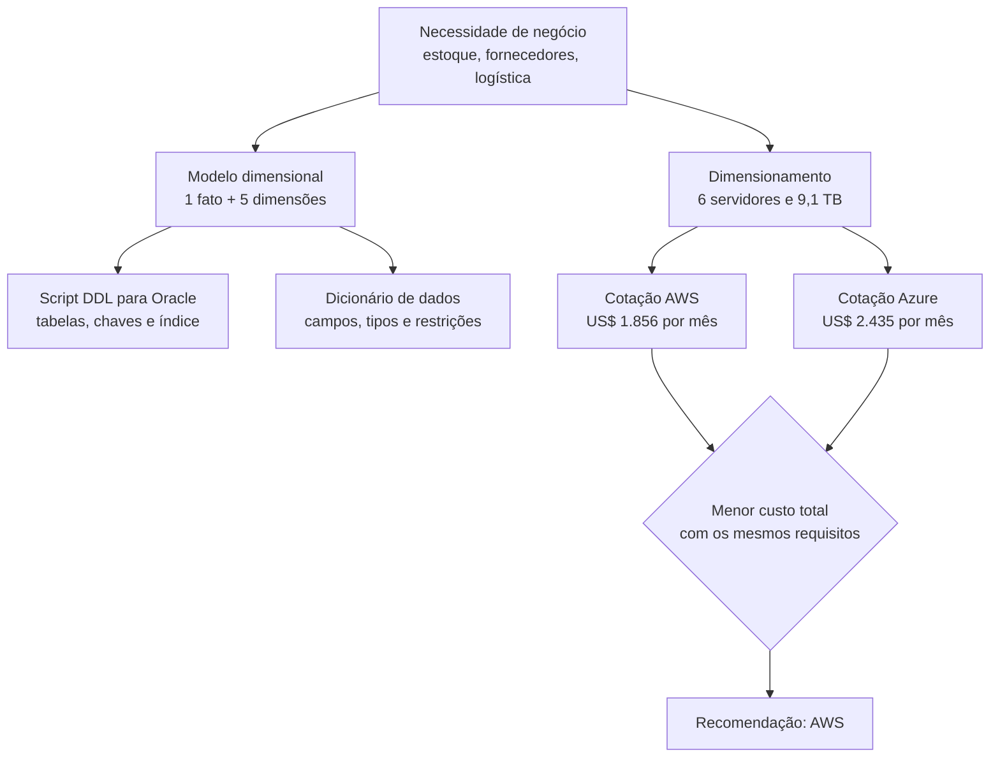
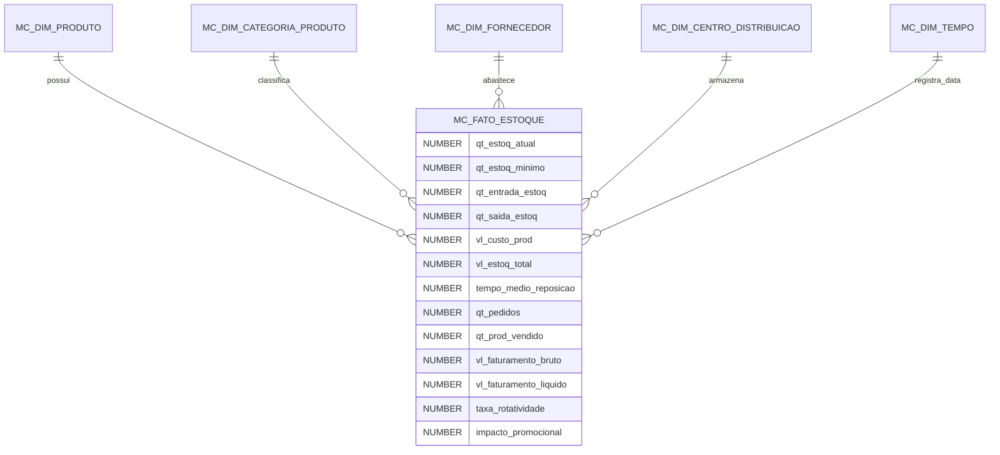

# Data Warehouse de Estoque para E-commerce e Comparação de Custos em Nuvem

Modelo dimensional de estoque, fornecedores e centros de distribuição para um e-commerce (nome da empresa omitido), com estimativa de custo de hospedagem na AWS e na Azure.


## Contexto

Um e-commerce precisa acompanhar estoque, desempenho de fornecedores e capacidade dos centros de distribuição para decidir quanto comprar e onde armazenar. Além disso, a base analítica precisa de uma infraestrutura, e a escolha do provedor de nuvem tem impacto direto no custo mensal.

## Solução

O projeto tem duas frentes:

1. **Modelagem dimensional** do estoque, com uma tabela fato e cinco dimensões, feita no Oracle SQL Developer Data Modeler (script gerado para Oracle Database 11g).
2. **Dimensionamento e cotação** da infraestrutura em AWS e Azure, com uma recomendação baseada no custo total mensal.

## Competências demonstradas

- **Modelagem dimensional de estoque:** fato com 13 métricas e 5 dimensões, DDL Oracle com constraints e índice.
- **Documentação técnica:** dicionário de dados, comentários nas colunas e diagrama do modelo físico.
- **Dimensionamento de infraestrutura e análise de custo:** premissas fixas, comparação item a item e recomendação sustentada por números.
- **Análise de trade-offs:** custo versus compatibilidade de arquitetura (instâncias ARM), documentado ao final.

## Lógica do projeto



**Por que estrela?** Consultas de estoque agregam medidas (quantidades, custos, faturamento) por produto, fornecedor, local e período. Uma fato central ligada a dimensões descritivas torna essas agregações diretas e rápidas.

**Por que comparar provedores com os mesmos requisitos?** Fixar a mesma configuração (servidores, armazenamento e tráfego) nas duas cotações isola o preço como única variável, o que torna a comparação justa.

### Modelo dimensional



| Dimensão | Atributos principais |
|---|---|
| `MC_DIM_PRODUTO` | SKU, nome, marca e cor |
| `MC_DIM_CATEGORIA_PRODUTO` | categoria, subcategoria, segmento e prioridade de abastecimento |
| `MC_DIM_FORNECEDOR` | localização, tempo médio de entrega e confiabilidade |
| `MC_DIM_CENTRO_DISTRIBUICAO` | localização e capacidade de armazenamento |
| `MC_DIM_TEMPO` | ano, mês, trimestre, semestre, dia, dia da semana e indicador de feriado |

## O que existe no repositório

| Arquivo | Conteúdo |
|---|---|
| `SCRIPT_DDL_MC.SQL` | DDL gerado pelo Data Modeler: 6 tabelas, 19 constraints (6 PK, 8 UNIQUE e 5 FK), 1 índice (`CHK_FERIADO_TEMPO`) e 45 comentários de coluna. O relatório do próprio script registra 0 erros e 0 avisos. |
| `cria.SQL` e `apaga.SQL` | Variante do script apenas de criação e script de remoção das tabelas. |
| `modelo-dimensional-fisico.pdf` | Diagrama do modelo dimensional físico. |
| `dicionario.pdf` | Dicionário de dados. |
| `orcamentos.md` | Cotação e comparação de custos AWS e Azure, com o nome da empresa omitido. |
| `calculo.xlsx` | Planilha de apoio com uma aba para cada cotação (AWS e Azure). |

## Análise de custos em nuvem

**Premissas:** 2 servidores Windows e 4 servidores Linux (4 vCPUs e 32 GB cada), 9,1 TB de armazenamento (7,28 TB em camada quente e 1,82 TB em camada fria, projetados com crescimento de 30% sobre 7 TB), cerca de 2 TB de saída de dados por mês e compromisso de 1 ano.

| Componente | AWS (US$/mês) | Azure (US$/mês) |
|---|---|---|
| Servidores Windows | 616,72 | 789,92 |
| Servidores Linux | 621,99 | 1.038,38 |
| Armazenamento (quente e frio) | 310,13 | 378,65 |
| Transferência de dados | 307,20 | 228,00 |
| **Total** | **1.856,04** | **2.434,95** |

A diferença é de cerca de **US$ 579 por mês** (aproximadamente US$ 6,9 mil por ano). Em outras palavras, a Azure custa cerca de 31% a mais que a AWS, e escolher a AWS reduz o custo em cerca de 24%. O documento recomenda a AWS.

## Como consultar o projeto

O modelo pode ser criado em um banco Oracle:

1. Se as tabelas já existirem, execute `apaga.SQL`.
2. Execute `cria.SQL` (ou `SCRIPT_DDL_MC.SQL`) como script completo.
3. Confira as tabelas criadas:

```sql
SELECT table_name FROM user_tables WHERE table_name LIKE 'MC\_%' ESCAPE '\' ORDER BY table_name;
```

Os demais arquivos (PDFs e planilha) são de consulta.

## Pontos de atenção e próximos passos

- O modelo não tem restrições `CHECK` (por exemplo, para o indicador de feriado). O índice `CHK_FERIADO_TEMPO` é um índice, não uma restrição.
- As cotações não registram a data de consulta dos preços, que variam com o tempo.
- Parte da diferença de custo vem do uso de instâncias Graviton (ARM) na AWS para os servidores Linux, o que exige que as aplicações sejam compatíveis com essa arquitetura.
- A planilha `calculo.xlsx` contém valores digitados, sem fórmulas. Para acompanhar cenários, o ideal é calcular os totais na própria planilha.
- Não há script de carga de dados nem consultas analíticas sobre o modelo.

### Caminho para produção e para IA

1. **Carga incremental com testes de qualidade de dados** e dimensões que guardam histórico de mudanças (por exemplo, de fornecedor ou de categoria).
2. **Indicadores de estoque** (ruptura, giro e cobertura) em dashboards sobre a fato.
3. **Previsão de demanda e de ponto de reposição** com Machine Learning, usando o histórico de entradas, saídas e vendas que a fato já prevê.

## Autoria

Dayanne Simão | [LinkedIn](https://www.linkedin.com/in/dayannesimao/)

Projeto acadêmico de Modelagem Dimensional e Computação em Nuvem. Uso para estudo e referência, com crédito à autora.
